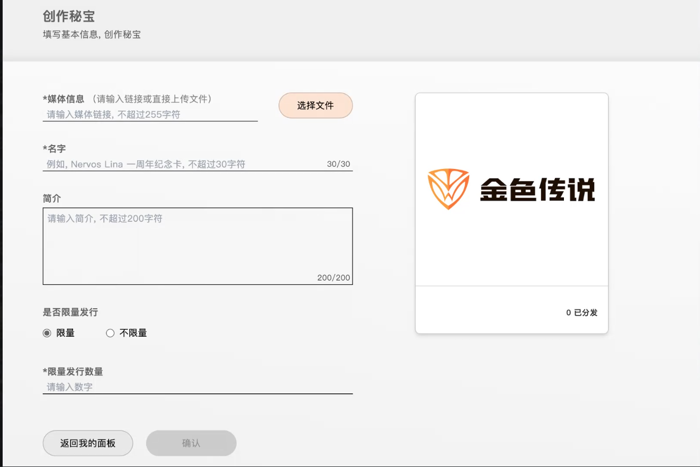
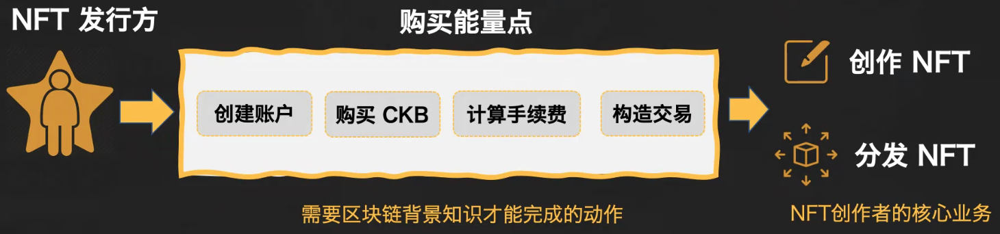
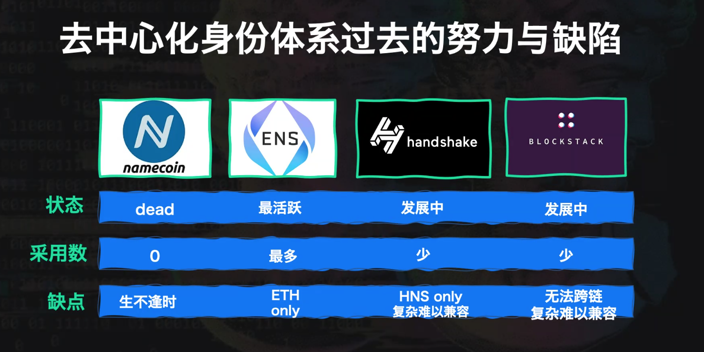
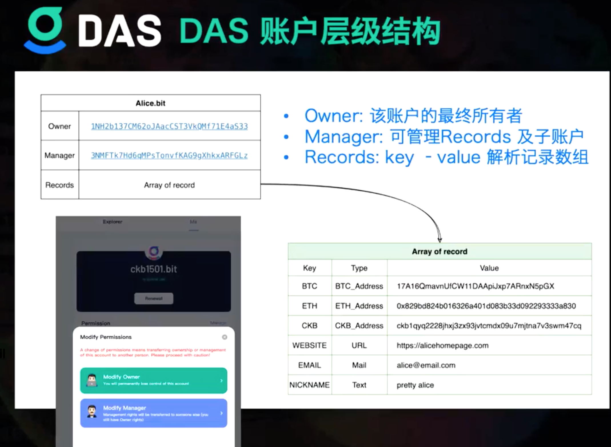
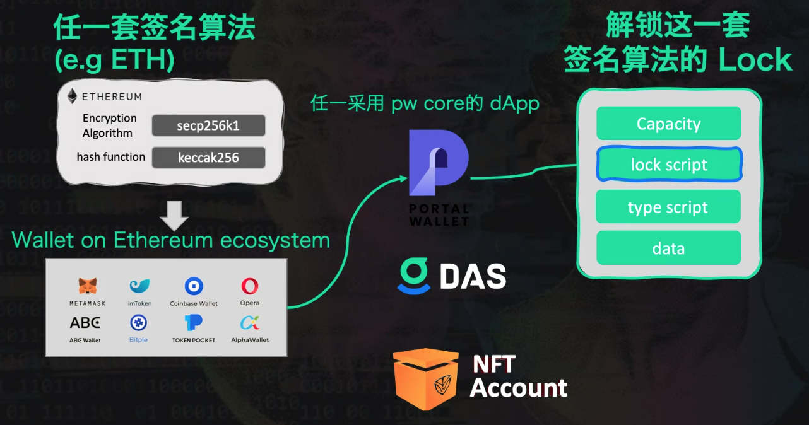
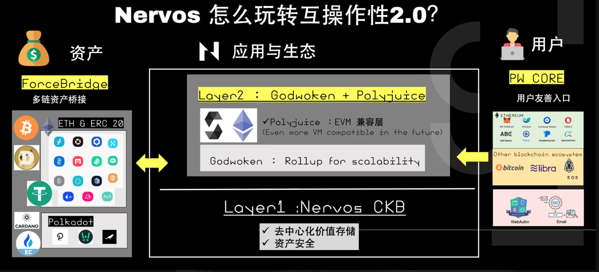

# Rebase--Nervos 金色传说

[toc]

## nervos介绍

**多资产的价值存储公链** 

``` 多资产```  可以部署智能合约发布资产，多链兼容

``` 价值存储```  算力安全和经济安全

- 算力安全
- 经济安全
- 多链兼容
- 底层抽象

### NFT背景 

20年-21年，平台交易量在21年1月开始增长，活跃钱包数量暴增

### Messary

NBA top shots交易额在nft市场占比62%，NFT是可以让最多的圈外用户进区块链的领域，

1. 圈外创作者和大ip缺乏友善的NFT发行平台

   ```圈外可以给区块链带来流量的人大部分不在区块链圈内，NFT发行者‘明星大多不懂区块链，钱包使用、地址、公私钥交易都可能成为他们的门槛```

2. 大量普通用户等待友善的NFT收藏平台


## Nervos第一个NFT平台

### NFT发行平台 -- 金色传说



- 填写对应的信息就可以发行NFT，之后可以进行分发distribute
- 可以通过法币平台购买金色能量，购买能量点取代了创建账号、购买代币、计算手续费、构造交易等需要区块链背景才能完成的操作，用户不需要接触到底层的区块链交易



### NFT Account -- 秘宝钱包

- 通过邮箱可以直接获得秘宝账户，通过邮箱签名，邮箱自带密码学原语【签名算法（zkim验证方式）】，通过秘宝钱包交易的NFT会显示在钱包上

  ```
  NFT收藏者
  1. 由邮箱和手机可以生成安全的区块链账户（不需要备份助记词）---unipass
  Nervos不限制签名算法，背后都是通过密码学原语来进行验证，在nervos上可以集成需要的各种签名算法
  unipass完成用户注册方式，指纹、邮箱等验证方式
  2. NFT流转不需要用户购买token来支付手续费 --- 通过cell模型（）来实现
          CELL          CKB的基础模型             
      --------------
     		 capacity       决定有多少的CKB容量来存储cell的状态   
     	[ lock script ]   决定谁可以解锁
     	[ type script ]   放置和合约相关的内容
     	[     data    ]
  
  ```

- 还会有很多的衍生应用

  - 钱包本身成为插件
  - 专辑以NFT形式出现
  - 可以从发行地址判断是不是正版 -- 收藏价值
  - 粉丝经济

- 币无感交易

```
1. 输入邮箱可以通过邮箱找回密钥？
不是，如果可以那就是有中心化的地方保存了个人密钥，如果密钥丢了会通过申请一个新的账户，通过这个邮箱将交易转移到新的账户

2. 秘宝钱包的交易中间没有接触到买币的操作？法币支付到中心化账户，由该账户来帮我付手续费？
交易NFT基本上就是比如说你给我比如说十块人民币，那我其实我是可以直接在不买任何的crypto token的情况下，直接把币转给你，因为在我的这个资产里面他已经带这个NFT所需的数千笔交易流转所需的手续费了，所以用户不需要担心手续费的问题。
比如说你想跟我要一个NFT，或者你给我钱，然后我转给你的NFT，因为我用户本身在交易这件事情上面，我拥有这个NFT，它同时里面也具有134KB，但是本身这些数据就占用134KB，那等于说我这个cell里面本身还剩下一个CKB，可以去做支付手续费矿工，所以在这个情形之下，那用户他就不需要再自己拿其他的里面有CKB的这些cell去拼装交易，然后去付交易手续费，它的原理是这个样子，所以等于其实是当初买就是买能量点，然后去发起的NFT这些发行商，但这些发行商不需要知道交易细节，由金色传说官方去完成发起交易的操作。NFT交易中间基本上就是最原始的CKB在流通。
```

- 面向用户更清晰，对圈外用户更友好

### NFT 浏览器

https://explorer.jinse.cc/

## DAS 去中心化账户服务 --- DID

- 用户自己保管自己的身份，身份是用户自己掌握的资产

- 个人名片作成为互联网新蓝海

  ```
  linktree 多平台数字身份
  用户可以通过Linktree更新其视频、电商、博客等多网站的地址，Linktree会生成专属链接，类似数字名片，用于用户的数字身份展示。在收费上，Linktree对Pro版本收取每月6美元费用，会有视频链接、链接缩略图和社交媒体图标的特权。
  ```

- 虚荣地址 -- 地址中有包含自己身份的字段

- 去中心化身份体系

  

- ABC Wallet

  - 可以在微信发BTC、CKB红包

    

https://da.services/?ref=block123

注册.bit域名作为去中心化身份，任何链的钱包都可以签名注册




.bit的账户是发行在ckb上的资产，包括这个.bit 的 cell里包括一些域名相关的信息，owner、各条公链上的地址，主页、email、昵称等等


```
- 互联网账户和区块链账户都可以注册
- .bit相当于发行在ckb上的资产
- 任何钱包都可以在ckb上签名，可以作为.bit域名的入口
- 任何区块链地址都可以是nervos dapp的地址，互联网用户也可以对应到nervos上的地址
```




- 任何签名算法都可以集成到CKB链上，还会有自己的解锁逻辑，集成到lockscript

- 普通钱包通过PW core在ckb上完成签名或者生成一个新的钱包，产生一个新的cell，完成注册一个CKB上面的资产，其实是一个域名，对应一个lockscript，这个lock是用于解锁这个资产，而且可以任意去替换各种签名算法

  

### Keeper机制

解决了UTXO占用的问题，同时有多个节点和同一个cell交互，cell合约占用的竞争

------   保证bit账户的唯一性


https://talk.nervos.org/t/das-ckb-keeper/5700

1. 用户发起一笔交易，释放一个包含注册信息的`指令Cell`，比如「我要注册 `c.bit`」，「我要注册 `d.bit`」。同时，这些 Cell 的 lock 是 `always_success`，任何人都可以消费它们。 这笔交易并不会将用户要注册的账户插入到有序链表中。
2. Keeper 通过监听链上状态，会发出一笔交易。将这两个`指令Cell`，作为 inputs，并在 outputs 中创建对应的 `AccountsCell（c.bit）`，`AccountsCell（d.bit）`，一起将他们插入到有序链表中合适的位置。

### DAS的前景

- 所有链的账户收款
- 所有网页的登录入口
- 个人名片（链接：linkedin，tg，medium，bilibili）
- DAS账户间加密端到端通信（活用公私钥）
- 作为荣誉象征（和交易所，钱包合作）

## Nervos抽象

- EVM兼容层layer2
- 跨链桥
- 支付通道
- 互操作性2.0

